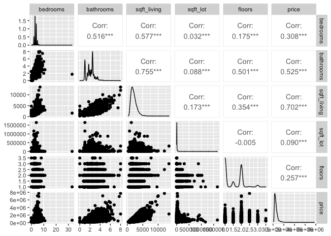
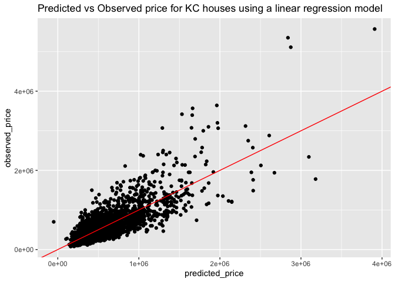
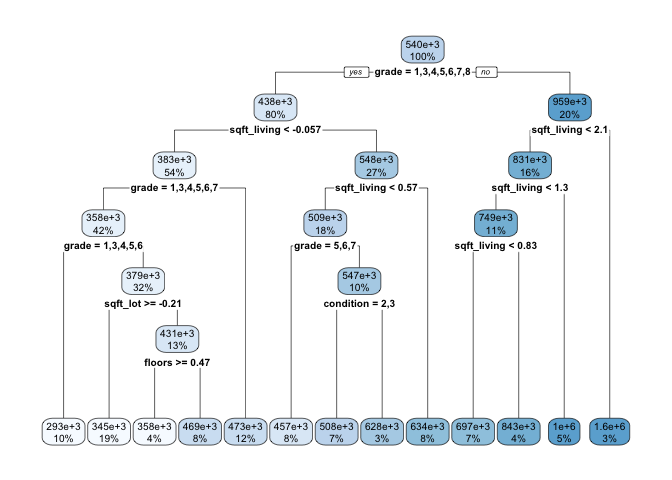
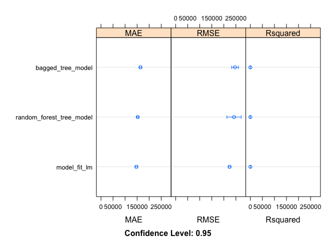

KC\_Housing\_Final
================

``` r
#Load libraries

library(dplyr)
```

    ## 
    ## Attaching package: 'dplyr'

    ## The following objects are masked from 'package:stats':
    ## 
    ##     filter, lag

    ## The following objects are masked from 'package:base':
    ## 
    ##     intersect, setdiff, setequal, union

``` r
library(ggplot2)
library(ggdendro)
library(stringr)
library(corrgram)
library(randomForest)
```

    ## randomForest 4.6-14

    ## Type rfNews() to see new features/changes/bug fixes.

    ## 
    ## Attaching package: 'randomForest'

    ## The following object is masked from 'package:ggplot2':
    ## 
    ##     margin

    ## The following object is masked from 'package:dplyr':
    ## 
    ##     combine

``` r
library(GGally)
```

    ## Registered S3 method overwritten by 'GGally':
    ##   method from   
    ##   +.gg   ggplot2

``` r
library(caret)
```

    ## Loading required package: lattice

    ## 
    ## Attaching package: 'lattice'

    ## The following object is masked from 'package:corrgram':
    ## 
    ##     panel.fill

``` r
library(tidyverse)
```

    ## ── Attaching packages ─────────────────────────────────────── tidyverse 1.3.1 ──

    ## ✓ tibble  3.1.6     ✓ purrr   0.3.4
    ## ✓ tidyr   1.1.4     ✓ forcats 0.5.1
    ## ✓ readr   2.1.1

    ## ── Conflicts ────────────────────────────────────────── tidyverse_conflicts() ──
    ## x randomForest::combine() masks dplyr::combine()
    ## x dplyr::filter()         masks stats::filter()
    ## x dplyr::lag()            masks stats::lag()
    ## x purrr::lift()           masks caret::lift()
    ## x randomForest::margin()  masks ggplot2::margin()

``` r
library(readxl)
library(rpart)
library(rpart.plot)
library(rsample)

#Set seed for consistent output
set.seed(1234)

#Data wrangling completed in Excel
#All of the data was in one column separted by commas, used delimeter to separate the values into their individual columns

#Import dataset
setwd("~/Documents/RStudio_Uploads/King_County_Housing_Analysis")
kc_house_data_1 <- read_excel("kc_house_data (1).xls")

kc_house_data_1 %>% glimpse()
```

    ## Rows: 21,613
    ## Columns: 21
    ## $ id            <dbl> 7129300520, 6414100192, 5631500400, 2487200875, 19544005…
    ## $ date          <chr> "20141013T000000", "20141209T000000", "20150225T000000",…
    ## $ price         <dbl> 221900, 538000, 180000, 604000, 510000, 1225000, 257500,…
    ## $ bedrooms      <dbl> 3, 3, 2, 4, 3, 4, 3, 3, 3, 3, 3, 2, 3, 3, 5, 4, 3, 4, 2,…
    ## $ bathrooms     <dbl> 1.00, 2.25, 1.00, 3.00, 2.00, 4.50, 2.25, 1.50, 1.00, 2.…
    ## $ sqft_living   <dbl> 1180, 2570, 770, 1960, 1680, 5420, 1715, 1060, 1780, 189…
    ## $ sqft_lot      <dbl> 5650, 7242, 10000, 5000, 8080, 101930, 6819, 9711, 7470,…
    ## $ floors        <dbl> 1.0, 2.0, 1.0, 1.0, 1.0, 1.0, 2.0, 1.0, 1.0, 2.0, 1.0, 1…
    ## $ waterfront    <dbl> 0, 0, 0, 0, 0, 0, 0, 0, 0, 0, 0, 0, 0, 0, 0, 0, 0, 0, 0,…
    ## $ view          <dbl> 0, 0, 0, 0, 0, 0, 0, 0, 0, 0, 0, 0, 0, 0, 0, 3, 0, 0, 0,…
    ## $ condition     <dbl> 3, 3, 3, 5, 3, 3, 3, 3, 3, 3, 3, 4, 4, 4, 3, 3, 3, 4, 4,…
    ## $ grade         <dbl> 7, 7, 6, 7, 8, 11, 7, 7, 7, 7, 8, 7, 7, 7, 7, 9, 7, 7, 7…
    ## $ sqft_above    <dbl> 1180, 2170, 770, 1050, 1680, 3890, 1715, 1060, 1050, 189…
    ## $ sqft_basement <dbl> 0, 400, 0, 910, 0, 1530, 0, 0, 730, 0, 1700, 300, 0, 0, …
    ## $ yr_built      <dbl> 1955, 1951, 1933, 1965, 1987, 2001, 1995, 1963, 1960, 20…
    ## $ yr_renovated  <dbl> 0, 1991, 0, 0, 0, 0, 0, 0, 0, 0, 0, 0, 0, 0, 0, 0, 0, 0,…
    ## $ zipcode       <dbl> 98178, 98125, 98028, 98136, 98074, 98053, 98003, 98198, …
    ## $ lat           <dbl> 47.5112, 47.7210, 47.7379, 47.5208, 47.6168, 47.6561, 47…
    ## $ long          <dbl> -122.257, -122.319, -122.233, -122.393, -122.045, -122.0…
    ## $ sqft_living15 <dbl> 1340, 1690, 2720, 1360, 1800, 4760, 2238, 1650, 1780, 23…
    ## $ sqft_lot15    <dbl> 5650, 7639, 8062, 5000, 7503, 101930, 6819, 9711, 8113, …

``` r
house_data_set = kc_house_data_1
```

``` r
#Prepare dataset

#View class types of variables for possible data type conversion
class(kc_house_data_1$id)
```

    ## [1] "numeric"

``` r
class(kc_house_data_1$view)
```

    ## [1] "numeric"

``` r
class(kc_house_data_1$grade)
```

    ## [1] "numeric"

``` r
class(kc_house_data_1$condition)
```

    ## [1] "numeric"

``` r
class(kc_house_data_1$lat)
```

    ## [1] "numeric"

``` r
class(kc_house_data_1$long)
```

    ## [1] "numeric"

``` r
class(kc_house_data_1$price)
```

    ## [1] "numeric"

``` r
#Remove columns from dataset that won't contribute to a good predictation model
house_data_set$id <- NULL
house_data_set$zipcode <- NULL
house_data_set$yr_renovated <- NULL

#In the interest of creating a simpler model, we are removing the date from the dataset and not look at seasonal trends
house_data_set$date <- NULL

#Change variable types
house_data_set = house_data_set %>% mutate(waterfront = as.factor(waterfront),
                                           view = as.factor(view),
                                           grade = as.factor(grade), 
                                           condition = as.factor(condition), 
                                           lat = as.factor(lat), long = as.factor(long))

#Verify variable type changes
is.factor(house_data_set$waterfront)
```

    ## [1] TRUE

``` r
is.factor(house_data_set$view)
```

    ## [1] TRUE

``` r
is.factor(house_data_set$grade)
```

    ## [1] TRUE

``` r
is.factor(house_data_set$condition)
```

    ## [1] TRUE

``` r
is.factor(house_data_set$lat)
```

    ## [1] TRUE

``` r
is.factor(house_data_set$long)
```

    ## [1] TRUE

``` r
#Feature engineering - create categorical variables to analyze mean price against various criteria in the dataset.

#Create variable for Newer Construction (2004 or newer) criteria
house_data_set = house_data_set %>% mutate(new_construction = ifelse(yr_built >= 2004, TRUE, FALSE))

#Create new variable for four bedroom criteria
house_data_set = house_data_set %>% mutate(four_bedroom = ifelse(bedrooms >= 4, TRUE, FALSE))

#Create new variable for 3 bathroom criteria
house_data_set= house_data_set %>% mutate(three_bathroom = ifelse(bathrooms >= 3.00, TRUE, FALSE))

#Create new variable for 4,000 sqft living criteria
house_data_set= house_data_set %>% mutate(sqft_living_criteria = ifelse(sqft_living >= 4000, TRUE, FALSE))

#Create new variable for 4,000 sqft15 living criteria
house_data_set= house_data_set %>% mutate(sqft_living15_criteria = ifelse(sqft_living15 >= 4000, TRUE, FALSE))

#Create new variable for Good grade (7+) criteria
#summary shows that housing grades range from 1 to 13
house_data_set$grade %>% summary()
```

    ##    1    3    4    5    6    7    8    9   10   11   12   13 
    ##    1    3   29  242 2038 8981 6068 2615 1134  399   90   13

``` r
good_grade_values <- c('7', '8', '9', '10', '11', '12', '13')
house_data_set= house_data_set %>% mutate(good_grade = ifelse(grade %in% good_grade_values, TRUE, FALSE))

#Create variable for good condition (5+) criteria
house_data_set$condition %>% summary
```

    ##     1     2     3     4     5 
    ##    30   172 14031  5679  1701

``` r
good_condition_values <- c('5')
house_data_set = house_data_set %>% mutate(good_condition = ifelse(condition %in% good_condition_values, TRUE, FALSE))

#Create new variable for 5,000 sqft lot criteria
house_data_set= house_data_set %>% mutate (sqft_lot_criteria = ifelse(sqft_lot >= 5000, TRUE, FALSE))

#Create new variable for 5,000 sqft_lot15 criteria
house_data_set= house_data_set %>% mutate (sqft_lot15_criteria = ifelse(sqft_lot15 >= 5000, TRUE, FALSE))

#Add column for log of sqft_living

house_data_set = house_data_set %>% mutate (log_sqft_living = log10(sqft_living))

#Add column for square root of sqft_living

house_data_set = house_data_set %>% mutate(sqrt_sqft_living = sqrt(sqft_living))
```

``` r
#Show quick summary of average prices grouped by the individual criteria above 
#(four bedroom, three bathroom, 4,000 sqft living, 7+ good grade, 5+ good condition, & 5,000 sqft lot)

#Average price grouped by four bedroom houses
avg_price_of_four_bedrooms = house_data_set %>% na.omit() %>% 
  group_by(four_bedroom) %>% 
  summarize(mean_price = mean(price))

#Average price grouped by three bathrooms houses
avg_price_of_three_bathrooms = house_data_set %>% na.omit() %>%
  group_by(three_bathroom) %>% 
  summarize(mean_price = mean(price)) 

#Average price grouped by 4,000 sqft_living houses
avg_price_of_4000_sqft = house_data_set %>% na.omit() %>%
  group_by(sqft_living_criteria) %>% 
  summarize(mean_price = mean(price)) 

#Average price grouped by 4,000 sqft_living15 houses
avg_price_of_4000_sqft15 = house_data_set %>% na.omit() %>%
  group_by(sqft_living15_criteria) %>% 
  summarize(mean_price = mean(price)) 

#Average price grouped by 5,000 sqft lot houses
avg_price_of_5000_sqft_lot = house_data_set %>% na.omit() %>%
  group_by(sqft_lot_criteria) %>% 
  summarize(mean_price = mean(price)) 

#Average price grouuped by 5,000 sqft_lot15 houses
avg_price_of_5000_sqft_lot = house_data_set %>% na.omit() %>%
  group_by(sqft_lot15_criteria) %>% 
  summarize(mean_price = mean(price)) 

#Average prices grouped by good condition (5+) houses
avg_price_of_good_condition = house_data_set %>% na.omit() %>%
  group_by(good_condition) %>% 
  summarize(mean_price = mean(price)) 

#Average prices grouped by new construction (>2004 construction) houses
avg_price_of_new_construction = house_data_set %>% na.omit() %>%
  group_by(new_construction) %>% 
  summarize(mean_price = mean(price)) 

#Average prices grouped by good grade (7+)
avg_price_of_good_grade = house_data_set %>% na.omit() %>%
  group_by(good_grade) %>% 
  summarize(mean_price = mean(price)) 

#View summary of data
house_data_set %>% glimpse()
```

    ## Rows: 21,613
    ## Columns: 28
    ## $ price                  <dbl> 221900, 538000, 180000, 604000, 510000, 1225000…
    ## $ bedrooms               <dbl> 3, 3, 2, 4, 3, 4, 3, 3, 3, 3, 3, 2, 3, 3, 5, 4,…
    ## $ bathrooms              <dbl> 1.00, 2.25, 1.00, 3.00, 2.00, 4.50, 2.25, 1.50,…
    ## $ sqft_living            <dbl> 1180, 2570, 770, 1960, 1680, 5420, 1715, 1060, …
    ## $ sqft_lot               <dbl> 5650, 7242, 10000, 5000, 8080, 101930, 6819, 97…
    ## $ floors                 <dbl> 1.0, 2.0, 1.0, 1.0, 1.0, 1.0, 2.0, 1.0, 1.0, 2.…
    ## $ waterfront             <fct> 0, 0, 0, 0, 0, 0, 0, 0, 0, 0, 0, 0, 0, 0, 0, 0,…
    ## $ view                   <fct> 0, 0, 0, 0, 0, 0, 0, 0, 0, 0, 0, 0, 0, 0, 0, 3,…
    ## $ condition              <fct> 3, 3, 3, 5, 3, 3, 3, 3, 3, 3, 3, 4, 4, 4, 3, 3,…
    ## $ grade                  <fct> 7, 7, 6, 7, 8, 11, 7, 7, 7, 7, 8, 7, 7, 7, 7, 9…
    ## $ sqft_above             <dbl> 1180, 2170, 770, 1050, 1680, 3890, 1715, 1060, …
    ## $ sqft_basement          <dbl> 0, 400, 0, 910, 0, 1530, 0, 0, 730, 0, 1700, 30…
    ## $ yr_built               <dbl> 1955, 1951, 1933, 1965, 1987, 2001, 1995, 1963,…
    ## $ lat                    <fct> 47.5112, 47.721, 47.7379, 47.5208, 47.6168, 47.…
    ## $ long                   <fct> -122.257, -122.319, -122.233, -122.393, -122.04…
    ## $ sqft_living15          <dbl> 1340, 1690, 2720, 1360, 1800, 4760, 2238, 1650,…
    ## $ sqft_lot15             <dbl> 5650, 7639, 8062, 5000, 7503, 101930, 6819, 971…
    ## $ new_construction       <lgl> FALSE, FALSE, FALSE, FALSE, FALSE, FALSE, FALSE…
    ## $ four_bedroom           <lgl> FALSE, FALSE, FALSE, TRUE, FALSE, TRUE, FALSE, …
    ## $ three_bathroom         <lgl> FALSE, FALSE, FALSE, TRUE, FALSE, TRUE, FALSE, …
    ## $ sqft_living_criteria   <lgl> FALSE, FALSE, FALSE, FALSE, FALSE, TRUE, FALSE,…
    ## $ sqft_living15_criteria <lgl> FALSE, FALSE, FALSE, FALSE, FALSE, TRUE, FALSE,…
    ## $ good_grade             <lgl> TRUE, TRUE, FALSE, TRUE, TRUE, TRUE, TRUE, TRUE…
    ## $ good_condition         <lgl> FALSE, FALSE, FALSE, TRUE, FALSE, FALSE, FALSE,…
    ## $ sqft_lot_criteria      <lgl> TRUE, TRUE, TRUE, TRUE, TRUE, TRUE, TRUE, TRUE,…
    ## $ sqft_lot15_criteria    <lgl> TRUE, TRUE, TRUE, TRUE, TRUE, TRUE, TRUE, TRUE,…
    ## $ log_sqft_living        <dbl> 3.071882, 3.409933, 2.886491, 3.292256, 3.22530…
    ## $ sqrt_sqft_living       <dbl> 34.35113, 50.69517, 27.74887, 44.27189, 40.9878…

``` r
house_data_set %>% summary()
```

    ##      price            bedrooms        bathrooms      sqft_living   
    ##  Min.   :  75000   Min.   : 0.000   Min.   :0.000   Min.   :  290  
    ##  1st Qu.: 321950   1st Qu.: 3.000   1st Qu.:1.750   1st Qu.: 1427  
    ##  Median : 450000   Median : 3.000   Median :2.250   Median : 1910  
    ##  Mean   : 540088   Mean   : 3.371   Mean   :2.115   Mean   : 2080  
    ##  3rd Qu.: 645000   3rd Qu.: 4.000   3rd Qu.:2.500   3rd Qu.: 2550  
    ##  Max.   :7700000   Max.   :33.000   Max.   :8.000   Max.   :13540  
    ##                                                                    
    ##     sqft_lot           floors      waterfront view      condition
    ##  Min.   :    520   Min.   :1.000   0:21450    0:19489   1:   30  
    ##  1st Qu.:   5040   1st Qu.:1.000   1:  163    1:  332   2:  172  
    ##  Median :   7618   Median :1.500              2:  963   3:14031  
    ##  Mean   :  15107   Mean   :1.494              3:  510   4: 5679  
    ##  3rd Qu.:  10688   3rd Qu.:2.000              4:  319   5: 1701  
    ##  Max.   :1651359   Max.   :3.500                                 
    ##                                                                  
    ##      grade        sqft_above   sqft_basement       yr_built         lat       
    ##  7      :8981   Min.   : 290   Min.   :   0.0   Min.   :1900   47.5322:   17  
    ##  8      :6068   1st Qu.:1190   1st Qu.:   0.0   1st Qu.:1951   47.5491:   17  
    ##  9      :2615   Median :1560   Median :   0.0   Median :1975   47.6624:   17  
    ##  6      :2038   Mean   :1788   Mean   : 291.5   Mean   :1971   47.6846:   17  
    ##  10     :1134   3rd Qu.:2210   3rd Qu.: 560.0   3rd Qu.:1997   47.6711:   16  
    ##  11     : 399   Max.   :9410   Max.   :4820.0   Max.   :2015   47.6886:   16  
    ##  (Other): 378                                                  (Other):21513  
    ##        long       sqft_living15    sqft_lot15     new_construction
    ##  -122.29 :  116   Min.   : 399   Min.   :   651   Mode :logical   
    ##  -122.3  :  111   1st Qu.:1490   1st Qu.:  5100   FALSE:18021     
    ##  -122.362:  104   Median :1840   Median :  7620   TRUE :3592      
    ##  -122.291:  100   Mean   :1987   Mean   : 12768                   
    ##  -122.372:   99   3rd Qu.:2360   3rd Qu.: 10083                   
    ##  -122.363:   99   Max.   :6210   Max.   :871200                   
    ##  (Other) :20984                                                   
    ##  four_bedroom    three_bathroom  sqft_living_criteria sqft_living15_criteria
    ##  Mode :logical   Mode :logical   Mode :logical        Mode :logical         
    ##  FALSE:12796     FALSE:18983     FALSE:20823          FALSE:21357           
    ##  TRUE :8817      TRUE :2630      TRUE :790            TRUE :256             
    ##                                                                             
    ##                                                                             
    ##                                                                             
    ##                                                                             
    ##  good_grade      good_condition  sqft_lot_criteria sqft_lot15_criteria
    ##  Mode :logical   Mode :logical   Mode :logical     Mode :logical      
    ##  FALSE:2313      FALSE:19912     FALSE:4932        FALSE:4722         
    ##  TRUE :19300     TRUE :1701      TRUE :16681       TRUE :16891        
    ##                                                                       
    ##                                                                       
    ##                                                                       
    ##                                                                       
    ##  log_sqft_living sqrt_sqft_living
    ##  Min.   :2.462   Min.   : 17.03  
    ##  1st Qu.:3.154   1st Qu.: 37.78  
    ##  Median :3.281   Median : 43.70  
    ##  Mean   :3.279   Mean   : 44.60  
    ##  3rd Qu.:3.407   3rd Qu.: 50.50  
    ##  Max.   :4.132   Max.   :116.36  
    ## 

    ## `geom_smooth()` using formula 'y ~ x'

<!-- -->

    ## `geom_smooth()` using formula 'y ~ x'

<!-- -->

    ## `geom_smooth()` using formula 'y ~ x'

<!-- -->

    ## `geom_smooth()` using formula 'y ~ x'

<!-- -->

    ## `geom_smooth()` using formula 'y ~ x'

<!-- -->

    ## Warning: Groups with fewer than two data points have been dropped.

    ## Warning in regularize.values(x, y, ties, missing(ties), na.rm = na.rm):
    ## collapsing to unique 'x' values
    
    ## Warning in regularize.values(x, y, ties, missing(ties), na.rm = na.rm):
    ## collapsing to unique 'x' values
    
    ## Warning in regularize.values(x, y, ties, missing(ties), na.rm = na.rm):
    ## collapsing to unique 'x' values

<!-- -->

    ## Warning in regularize.values(x, y, ties, missing(ties), na.rm = na.rm):
    ## collapsing to unique 'x' values
    
    ## Warning in regularize.values(x, y, ties, missing(ties), na.rm = na.rm):
    ## collapsing to unique 'x' values
    
    ## Warning in regularize.values(x, y, ties, missing(ties), na.rm = na.rm):
    ## collapsing to unique 'x' values

<!-- -->

    ## Warning in regularize.values(x, y, ties, missing(ties), na.rm = na.rm):
    ## collapsing to unique 'x' values

<!-- -->

    ## Warning in regularize.values(x, y, ties, missing(ties), na.rm = na.rm):
    ## collapsing to unique 'x' values
    
    ## Warning in regularize.values(x, y, ties, missing(ties), na.rm = na.rm):
    ## collapsing to unique 'x' values
    
    ## Warning in regularize.values(x, y, ties, missing(ties), na.rm = na.rm):
    ## collapsing to unique 'x' values

<!-- -->

<!-- -->

``` r
#Calculate correlation coefficients for all variables between other variables

help("setdiff")
```

    ## Help on topic 'setdiff' was found in the following packages:
    ## 
    ##   Package               Library
    ##   lubridate             /Library/Frameworks/R.framework/Versions/4.0/Resources/library
    ##   base                  /Library/Frameworks/R.framework/Resources/library
    ##   generics              /Library/Frameworks/R.framework/Versions/4.0/Resources/library
    ##   dplyr                 /Library/Frameworks/R.framework/Versions/4.0/Resources/library
    ##   data.table            /Library/Frameworks/R.framework/Versions/4.0/Resources/library
    ## 
    ## 
    ## Using the first match ...

``` r
#Correlation coefficient of price to all other numeric variables
i1 <- sapply(house_data_set, is.numeric)
y1 <- "price"
x1 <- setdiff(names(house_data_set)[i1], y1)
cor_of_price_to_vars <- cor(house_data_set[x1], house_data_set[[y1]])

#Correlation coefficient of bedrooms to all other numeric variables
i2 <- sapply(house_data_set, is.numeric)
y2 <- "bedrooms"
x2 <- setdiff(names(house_data_set)[i2], y2)
cor_of_bedrooms_to_vars <- cor(house_data_set[x2], house_data_set[[y2]])

#Correlation coefficient of sqft_above to all other numeric variables
i3 <- sapply(house_data_set, is.numeric)
y3 <- "sqft_above"
x3 <- setdiff(names(house_data_set)[i3], y3)
cor_of_sqft_above_to_vars <- cor(house_data_set[x3], house_data_set[[y3]])

#Correlation coefficient of sqft_living to all other numeric variables
i4 <- sapply(house_data_set, is.numeric)
y4 <- "sqft_living"
x4 <- setdiff(names(house_data_set)[i4], y4)
cor_of_sqft_living_to_vars <- cor(house_data_set[x4], house_data_set[[y4]])

#Correlation coefficient of sqft_lot to all other numeric variables
i5 <- sapply(house_data_set, is.numeric)
y5 <- "sqft_lot"
x5 <- setdiff(names(house_data_set)[i5], y5)
cor_of_sqft_lot_to_vars <- cor(house_data_set[x5], house_data_set[[y5]])

#Correlation coefficient of sqft_lot15 to all other numeric variables
i6 <- sapply(house_data_set, is.numeric)
y6 <- "sqft_lot15"
x6 <- setdiff(names(house_data_set)[i6], y6)
cor_of_sqft_lot15_to_vars <- cor(house_data_set[x6], house_data_set[[y6]])

#Correlation coefficient of sqft_living15 to all other numeric variables
i7 <- sapply(house_data_set, is.numeric)
y7 <- "sqft_living15"
x7 <- setdiff(names(house_data_set)[i7], y7)
cor_of_sqft_living15_to_vars <- cor(house_data_set[x7], house_data_set[[y7]])

#Correlation coefficient of floors to all other numeric variables
i8 <- sapply(house_data_set, is.numeric)
y8 <- "floors"
x8 <- setdiff(names(house_data_set)[i8], y8)
cor_of_floors_to_vars <- cor(house_data_set[x8], house_data_set[[y8]])

#Correlation coefficient of sqft_basement to all other numeric variables
i9 <- sapply(house_data_set, is.numeric)
y9 <- "sqft_basement"
x9 <- setdiff(names(house_data_set)[i9], y9)
cor_of_sqft_basement_to_vars <- cor(house_data_set[x9], house_data_set[[y9]])

#Correlation coefficient of yr_built to all other numeric variables
i10 <- sapply(house_data_set, is.numeric)
y10 <- "yr_built"
x10 <- setdiff(names(house_data_set)[i10], y10)
cor_of_yr_built_to_vars <- cor(house_data_set[x10], house_data_set[[y10]])

#Spot check formula above 
cor.test(house_data_set$price, house_data_set$sqft_lot15) #.082 correlation
```

    ## 
    ##  Pearson's product-moment correlation
    ## 
    ## data:  house_data_set$price and house_data_set$sqft_lot15
    ## t = 12.162, df = 21611, p-value < 2.2e-16
    ## alternative hypothesis: true correlation is not equal to 0
    ## 95 percent confidence interval:
    ##  0.06919122 0.09567398
    ## sample estimates:
    ##        cor 
    ## 0.08244715

``` r
cor.test(house_data_set$price, house_data_set$sqft_living) #.702 correlation
```

    ## 
    ##  Pearson's product-moment correlation
    ## 
    ## data:  house_data_set$price and house_data_set$sqft_living
    ## t = 144.92, df = 21611, p-value < 2.2e-16
    ## alternative hypothesis: true correlation is not equal to 0
    ## 95 percent confidence interval:
    ##  0.6952099 0.7087336
    ## sample estimates:
    ##       cor 
    ## 0.7020351

``` r
cor.test(house_data_set$price, house_data_set$sqft_above) #.606 correlation
```

    ## 
    ##  Pearson's product-moment correlation
    ## 
    ## data:  house_data_set$price and house_data_set$sqft_above
    ## t = 111.87, df = 21611, p-value < 2.2e-16
    ## alternative hypothesis: true correlation is not equal to 0
    ## 95 percent confidence interval:
    ##  0.5970556 0.6139427
    ## sample estimates:
    ##       cor 
    ## 0.6055673

``` r
cor.test(house_data_set$price, house_data_set$sqft_living15) #.585 correlation
```

    ## 
    ##  Pearson's product-moment correlation
    ## 
    ## data:  house_data_set$price and house_data_set$sqft_living15
    ## t = 106.14, df = 21611, p-value < 2.2e-16
    ## alternative hypothesis: true correlation is not equal to 0
    ## 95 percent confidence interval:
    ##  0.5765464 0.5940746
    ## sample estimates:
    ##       cor 
    ## 0.5853789

``` r
cor.test(house_data_set$price, house_data_set$bathrooms) #.525 correlation
```

    ## 
    ##  Pearson's product-moment correlation
    ## 
    ## data:  house_data_set$price and house_data_set$bathrooms
    ## t = 90.714, df = 21611, p-value < 2.2e-16
    ## alternative hypothesis: true correlation is not equal to 0
    ## 95 percent confidence interval:
    ##  0.5154140 0.5347258
    ## sample estimates:
    ##       cor 
    ## 0.5251375

``` r
cor.test(house_data_set$price, house_data_set$sqft_basement) #.324 correlation
```

    ## 
    ##  Pearson's product-moment correlation
    ## 
    ## data:  house_data_set$price and house_data_set$sqft_basement
    ## t = 50.314, df = 21611, p-value < 2.2e-16
    ## alternative hypothesis: true correlation is not equal to 0
    ## 95 percent confidence interval:
    ##  0.3118302 0.3356988
    ## sample estimates:
    ##      cor 
    ## 0.323816

``` r
cor.test(house_data_set$price, house_data_set$bedrooms) #.308 correlation
```

    ## 
    ##  Pearson's product-moment correlation
    ## 
    ## data:  house_data_set$price and house_data_set$bedrooms
    ## t = 47.651, df = 21611, p-value < 2.2e-16
    ## alternative hypothesis: true correlation is not equal to 0
    ## 95 percent confidence interval:
    ##  0.2962354 0.3203646
    ## sample estimates:
    ##       cor 
    ## 0.3083496

``` r
cor.test(house_data_set$price, house_data_set$floors) #.257 correlation
```

    ## 
    ##  Pearson's product-moment correlation
    ## 
    ## data:  house_data_set$price and house_data_set$floors
    ## t = 39.06, df = 21611, p-value < 2.2e-16
    ## alternative hypothesis: true correlation is not equal to 0
    ## 95 percent confidence interval:
    ##  0.2442983 0.2692042
    ## sample estimates:
    ##       cor 
    ## 0.2567939

``` r
cor.test(house_data_set$price, house_data_set$sqft_lot) #.089 correlation
```

    ## 
    ##  Pearson's product-moment correlation
    ## 
    ## data:  house_data_set$price and house_data_set$sqft_lot
    ## t = 13.234, df = 21611, p-value < 2.2e-16
    ## alternative hypothesis: true correlation is not equal to 0
    ## 95 percent confidence interval:
    ##  0.07642022 0.10286988
    ## sample estimates:
    ##        cor 
    ## 0.08966086

``` r
cor.test(house_data_set$price, house_data_set$yr_built) #.054 correlation-
```

    ## 
    ##  Pearson's product-moment correlation
    ## 
    ## data:  house_data_set$price and house_data_set$yr_built
    ## t = 7.9517, df = 21611, p-value = 1.93e-15
    ## alternative hypothesis: true correlation is not equal to 0
    ## 95 percent confidence interval:
    ##  0.04070886 0.06729506
    ## sample estimates:
    ##        cor 
    ## 0.05401153

``` r
#Remove true/false variables for model training datasets

model_data_set = select(house_data_set, -four_bedroom, -three_bathroom, -sqft_living15_criteria, -good_condition, -new_construction,
                        -good_grade, -sqft_lot_criteria, -sqft_lot15_criteria)

#Split data into test and train set
in_train = createDataPartition(y = model_data_set$price, p = .80, list = FALSE)
head(in_train)
```

    ##      Resample1
    ## [1,]         2
    ## [2,]         3
    ## [3,]         4
    ## [4,]         6
    ## [5,]         7
    ## [6,]         8

``` r
#Display all columns in both training and testing sets
house_data_training_set = model_data_set[in_train, ]
house_data_testing_set = model_data_set[-in_train, ]

#Preprocessing steps (centering and scaling)
#bedrooms, bathrooms, sqft_living, sqft_lot, floors, sqft_above,sqft_basement

# Look for and remove near zero variances (sqft_basement, wate)
nearZeroVar(house_data_training_set, saveMetrics = TRUE)
```

    ##                       freqRatio percentUnique zeroVar   nzv
    ## price                  1.130769   20.51815869   FALSE FALSE
    ## bedrooms               1.427225    0.07517927   FALSE FALSE
    ## bathrooms              1.405934    0.17349063   FALSE FALSE
    ## sqft_living            1.056075    5.39555864   FALSE FALSE
    ## sqft_lot               1.221277   48.77978256   FALSE FALSE
    ## floors                 1.296392    0.03469813   FALSE FALSE
    ## waterfront           139.585366    0.01156604   FALSE  TRUE
    ## view                  20.143226    0.02891511   FALSE  TRUE
    ## condition              2.468427    0.02891511   FALSE FALSE
    ## grade                  1.475164    0.06939625   FALSE FALSE
    ## sqft_above             1.017045    4.90400185   FALSE FALSE
    ## sqft_basement         58.272222    1.66551006   FALSE  TRUE
    ## yr_built               1.194070    0.67083044   FALSE FALSE
    ## lat                    1.071429   28.07078418   FALSE FALSE
    ## long                   1.033708    4.22738839   FALSE FALSE
    ## sqft_living15          1.097403    4.06546380   FALSE FALSE
    ## sqft_lot15             1.190311   43.81795050   FALSE FALSE
    ## sqft_living_criteria  26.231496    0.01156604   FALSE  TRUE
    ## log_sqft_living        1.056075    5.39555864   FALSE FALSE
    ## sqrt_sqft_living       1.056075    5.39555864   FALSE FALSE

``` r
help("preProcess")
preprocessing_steps = preProcess(select(model_data_set, bedrooms, bathrooms, sqft_living, sqft_lot, floors, sqft_above, sqft_basement),
           method = c('center', 'scale', 'nzv'))

house_data_train_proc = predict(preprocessing_steps, newdata = house_data_training_set)
house_data_test_proc = predict(preprocessing_steps, newdata = house_data_testing_set)

head(house_data_train_proc)
```

    ## # A tibble: 6 × 19
    ##     price bedrooms bathrooms sqft_living sqft_lot floors waterfront view 
    ##     <dbl>    <dbl>     <dbl>       <dbl>    <dbl>  <dbl> <fct>      <fct>
    ## 1  538000   -0.399     0.176       0.534   -0.190  0.936 0          0    
    ## 2  180000   -1.47     -1.45       -1.43    -0.123 -0.915 0          0    
    ## 3  604000    0.676     1.15       -0.131   -0.244 -0.915 0          0    
    ## 4 1225000    0.676     3.10        3.64     2.10  -0.915 0          0    
    ## 5  257500   -0.399     0.176      -0.397   -0.200  0.936 0          0    
    ## 6  291850   -0.399    -0.798      -1.11    -0.130 -0.915 0          0    
    ## # … with 11 more variables: condition <fct>, grade <fct>, sqft_above <dbl>,
    ## #   yr_built <dbl>, lat <fct>, long <fct>, sqft_living15 <dbl>,
    ## #   sqft_lot15 <dbl>, sqft_living_criteria <lgl>, log_sqft_living <dbl>,
    ## #   sqrt_sqft_living <dbl>

``` r
head(house_data_test_proc)
```

    ## # A tibble: 6 × 19
    ##    price bedrooms bathrooms sqft_living sqft_lot  floors waterfront view 
    ##    <dbl>    <dbl>     <dbl>       <dbl>    <dbl>   <dbl> <fct>      <fct>
    ## 1 221900   -0.399    -1.45       -0.980  -0.228  -0.915  0          0    
    ## 2 510000   -0.399    -0.149      -0.435  -0.170  -0.915  0          0    
    ## 3 662500   -0.399     0.500       1.61   -0.128  -0.915  0          0    
    ## 4 310000   -0.399    -1.45       -0.708   0.116   0.0105 0          0    
    ## 5 400000   -0.399    -0.474      -0.773  -0.131  -0.915  0          0    
    ## 6 395000   -0.399    -0.149      -0.207  -0.0258  0.936  0          0    
    ## # … with 11 more variables: condition <fct>, grade <fct>, sqft_above <dbl>,
    ## #   yr_built <dbl>, lat <fct>, long <fct>, sqft_living15 <dbl>,
    ## #   sqft_lot15 <dbl>, sqft_living_criteria <lgl>, log_sqft_living <dbl>,
    ## #   sqrt_sqft_living <dbl>

    ## Warning in predict.lm(modelFit, newdata): prediction from a rank-deficient fit
    ## may be misleading

    ##        1        2        3        4        5        6 
    ## 282589.0 413727.5 764573.0 376675.3 358908.0 399803.7

    ## 
    ## Call:
    ## lm(formula = .outcome ~ ., data = dat)
    ## 
    ## Residuals:
    ##      Min       1Q   Median       3Q      Max 
    ## -1831545  -120082   -19876    90596  4681995 
    ## 
    ## Coefficients:
    ##              Estimate Std. Error t value Pr(>|t|)    
    ## (Intercept)  350741.5   222182.3   1.579  0.11444    
    ## grade3       -80405.8   276505.4  -0.291  0.77121    
    ## grade4       -14712.9   232025.5  -0.063  0.94944    
    ## grade5       -13856.2   227986.5  -0.061  0.95154    
    ## grade6        16052.8   227650.8   0.071  0.94378    
    ## grade7        49927.1   227691.3   0.219  0.82644    
    ## grade8       114345.1   227746.4   0.502  0.61562    
    ## grade9       245587.9   227839.5   1.078  0.28109    
    ## grade10      432364.8   227978.8   1.897  0.05791 .  
    ## grade11      736171.4   228331.4   3.224  0.00127 ** 
    ## grade12     1181702.2   229625.5   5.146 2.69e-07 ***
    ## grade13     2438268.6   239389.3  10.185  < 2e-16 ***
    ## bathrooms      -994.2     2935.3  -0.339  0.73484    
    ## view1        145621.4    13759.3  10.584  < 2e-16 ***
    ## view2         92324.3     8371.7  11.028  < 2e-16 ***
    ## view3        164384.1    11609.6  14.159  < 2e-16 ***
    ## view4        442049.1    14970.0  29.529  < 2e-16 ***
    ## sqft_living  176810.3     4797.7  36.853  < 2e-16 ***
    ## sqft_above   -45522.3     4288.7 -10.614  < 2e-16 ***
    ## sqft_lot     -12920.7     1780.0  -7.259 4.07e-13 ***
    ## bedrooms     -17695.7     2187.2  -8.091 6.33e-16 ***
    ## floors        12673.7     2346.3   5.401 6.70e-08 ***
    ## condition2    29752.7    53023.0   0.561  0.57472    
    ## condition3    21873.3    49931.2   0.438  0.66134    
    ## condition4    74285.2    49967.0   1.487  0.13712    
    ## condition5   151617.5    50227.8   3.019  0.00254 ** 
    ## ---
    ## Signif. codes:  0 '***' 0.001 '**' 0.01 '*' 0.05 '.' 0.1 ' ' 1
    ## 
    ## Residual standard error: 222000 on 17266 degrees of freedom
    ## Multiple R-squared:  0.6335, Adjusted R-squared:  0.633 
    ## F-statistic:  1194 on 25 and 17266 DF,  p-value: < 2.2e-16

    ##         RMSE     Rsquared          MAE 
    ## 220667.25171      0.64357 145132.02725

    ##   predicted_price observed_price      error
    ## 1        282589.0         221900  60689.016
    ## 2        413727.5         510000 -96272.527
    ## 3        764573.0         662500 102073.044
    ## 4        376675.3         310000  66675.269
    ## 5        358908.0         400000 -41092.016
    ## 6        399803.7         395000   4803.694

    ##      predicted_price observed_price     error
    ## 4316        719091.1         594866 124225.07
    ## 4317        429628.4         490000 -60371.59
    ## 4318        555871.2         347500 208371.21
    ## 4319        793070.6         679950 113120.63
    ## 4320        441559.3         360000  81559.34
    ## 4321        427324.7         400000  27324.71

<!-- -->

    ##    1    3    4    5    6    7    8    9   10   11   12   13 
    ##    1    2   22  186 1635 7187 4872 2077  903  322   75   10

    ##                        Overall
    ## grade                1.0576402
    ## lat                  4.2188471
    ## log_sqft_living      2.5297560
    ## long                 1.7294686
    ## sqft_living          2.5732147
    ## sqft_living_criteria 0.5268123
    ## sqft_living15        0.4010191
    ## sqrt_sqft_living     2.4028155
    ## yr_built             0.1212612
    ## bedrooms             0.0000000
    ## bathrooms            0.0000000
    ## sqft_lot             0.0000000
    ## floors               0.0000000
    ## waterfront           0.0000000
    ## view                 0.0000000
    ## condition            0.0000000
    ## sqft_above           0.0000000
    ## sqft_lot15           0.0000000

<!-- -->

    ## Call:
    ## rpart(formula = price ~ grade + bathrooms + view + sqft_living + 
    ##     sqft_above + sqft_lot + bedrooms + floors + condition, data = house_data_train_proc, 
    ##     method = "anova", control = rpart.control(minsplit = 1750, 
    ##         cp = 0.001))
    ##   n= 17292 
    ## 
    ##             CP nsplit rel error    xerror       xstd
    ## 1  0.318730314      0 1.0000000 1.0001165 0.04662801
    ## 2  0.115423983      1 0.6812697 0.6942956 0.03739094
    ## 3  0.036135126      2 0.5658457 0.5718070 0.02970724
    ## 4  0.017515798      3 0.5297106 0.5413344 0.02961704
    ## 5  0.008905805      4 0.5121948 0.5266716 0.02946334
    ## 6  0.006703066      5 0.5032890 0.5185542 0.02945816
    ## 7  0.004334442      6 0.4965859 0.5135343 0.02942402
    ## 8  0.004168840      7 0.4922515 0.5091240 0.02941740
    ## 9  0.004046317      8 0.4880826 0.5071014 0.02941776
    ## 10 0.002697299      9 0.4840363 0.5044164 0.02940724
    ## 11 0.002623130     10 0.4813390 0.5024933 0.02940782
    ## 12 0.002454968     11 0.4787159 0.5007136 0.02940616
    ## 13 0.001000000     12 0.4762609 0.4984547 0.02940888
    ## 
    ## Variable importance
    ##       grade sqft_living  sqft_above   bathrooms    bedrooms        view 
    ##          35          29          22          10           2           1 
    ##    sqft_lot 
    ##           1 
    ## 
    ## Node number 1: 17292 observations,    complexity param=0.3187303
    ##   mean=539716.1, MSE=1.343184e+11 
    ##   left son=2 (13905 obs) right son=3 (3387 obs)
    ##   Primary splits:
    ##       grade       splits as  LLLLLLLRRRRR, improve=0.3187303, (0 missing)
    ##       sqft_living < 1.44386     to the left,  improve=0.3124032, (0 missing)
    ##       sqft_above  < 1.278977    to the left,  improve=0.2313241, (0 missing)
    ##       bathrooms   < 1.311726    to the left,  improve=0.2240861, (0 missing)
    ##       view        splits as  LRRRR, improve=0.1245664, (0 missing)
    ##   Surrogate splits:
    ##       sqft_above  < 0.8539029   to the left,  agree=0.885, adj=0.413, (0 split)
    ##       sqft_living < 0.9185134   to the left,  agree=0.882, adj=0.397, (0 split)
    ##       bathrooms   < 1.311726    to the left,  agree=0.842, adj=0.194, (0 split)
    ##       view        splits as  LLLRR, agree=0.809, adj=0.024, (0 split)
    ##       sqft_lot    < -0.3487395  to the right, agree=0.804, adj=0.001, (0 split)
    ## 
    ## Node number 2: 13905 observations,    complexity param=0.03613513
    ##   mean=437598.2, MSE=3.806092e+10 
    ##   left son=4 (9311 obs) right son=5 (4594 obs)
    ##   Primary splits:
    ##       sqft_living < -0.05650852 to the left,  improve=0.15858430, (0 missing)
    ##       grade       splits as  LLLLLLR-----, improve=0.15487580, (0 missing)
    ##       sqft_above  < -0.4496978  to the left,  improve=0.08467562, (0 missing)
    ##       view        splits as  LRRRR, improve=0.07665065, (0 missing)
    ##       bathrooms   < -0.6359137  to the left,  improve=0.06815830, (0 missing)
    ##   Surrogate splits:
    ##       sqft_above < 0.2893514   to the left,  agree=0.842, adj=0.522, (0 split)
    ##       bedrooms   < 0.1388707   to the left,  agree=0.768, adj=0.297, (0 split)
    ##       bathrooms  < 0.3379059   to the left,  agree=0.757, adj=0.263, (0 split)
    ##       grade      splits as  LLLLLLR-----, agree=0.732, adj=0.190, (0 split)
    ##       view       splits as  LRRRR, agree=0.680, adj=0.032, (0 split)
    ## 
    ## Node number 3: 3387 observations,    complexity param=0.115424
    ##   mean=958950.9, MSE=3.10925e+11 
    ##   left son=6 (2803 obs) right son=7 (584 obs)
    ##   Primary splits:
    ##       sqft_living < 2.10694     to the left,  improve=0.2545693, (0 missing)
    ##       grade       splits as  -------LRRRR, improve=0.1821285, (0 missing)
    ##       bathrooms   < 1.311726    to the left,  improve=0.1676714, (0 missing)
    ##       sqft_above  < 2.16958     to the left,  improve=0.1553549, (0 missing)
    ##       view        splits as  LRRRR, improve=0.1075784, (0 missing)
    ##   Surrogate splits:
    ##       sqft_above < 2.688846    to the left,  agree=0.921, adj=0.545, (0 split)
    ##       grade      splits as  -------LLRRR, agree=0.874, adj=0.269, (0 split)
    ##       bathrooms  < 1.960939    to the left,  agree=0.870, adj=0.248, (0 split)
    ##       bedrooms   < 2.289265    to the left,  agree=0.832, adj=0.026, (0 split)
    ## 
    ## Node number 4: 9311 observations,    complexity param=0.008905805
    ##   mean=383026.6, MSE=2.342401e+10 
    ##   left son=8 (7312 obs) right son=9 (1999 obs)
    ##   Primary splits:
    ##       grade       splits as  LLLLLLR-----, improve=0.09484105, (0 missing)
    ##       sqft_living < -0.737554   to the left,  improve=0.07266677, (0 missing)
    ##       sqft_lot    < -0.2403149  to the right, improve=0.06710619, (0 missing)
    ##       bathrooms   < -1.285127   to the left,  improve=0.03515194, (0 missing)
    ##       floors      < -0.4524333  to the left,  improve=0.02981632, (0 missing)
    ##   Surrogate splits:
    ##       sqft_lot   < -0.3127187  to the right, agree=0.817, adj=0.146, (0 split)
    ##       floors     < 1.399457    to the left,  agree=0.809, adj=0.109, (0 split)
    ##       bathrooms  < 1.311726    to the left,  agree=0.793, adj=0.034, (0 split)
    ##       sqft_above < 0.140817    to the left,  agree=0.787, adj=0.010, (0 split)
    ## 
    ## Node number 5: 4594 observations,    complexity param=0.006703066
    ##   mean=548202.6, MSE=4.945742e+10 
    ##   left son=10 (3147 obs) right son=11 (1447 obs)
    ##   Primary splits:
    ##       sqft_living < 0.569008    to the left,  improve=0.06852227, (0 missing)
    ##       grade       splits as  ---LLLR-----, improve=0.05933379, (0 missing)
    ##       condition   splits as  LLLRR, improve=0.03202129, (0 missing)
    ##       bathrooms   < 0.6625124   to the left,  improve=0.01710674, (0 missing)
    ##       sqft_lot    < -0.2439725  to the right, improve=0.01432971, (0 missing)
    ##   Surrogate splits:
    ##       sqft_above < 0.9861348   to the left,  agree=0.828, adj=0.455, (0 split)
    ##       bathrooms  < 1.311726    to the left,  agree=0.719, adj=0.106, (0 split)
    ##       bedrooms   < 1.214068    to the left,  agree=0.706, adj=0.068, (0 split)
    ##       sqft_lot   < 5.009222    to the left,  agree=0.687, adj=0.005, (0 split)
    ##       view       splits as  LLLLR, agree=0.686, adj=0.004, (0 split)
    ## 
    ## Node number 6: 2803 observations,    complexity param=0.0175158
    ##   mean=830532.9, MSE=1.255686e+11 
    ##   left son=12 (1925 obs) right son=13 (878 obs)
    ##   Primary splits:
    ##       sqft_living < 1.257675    to the left,  improve=0.115586300, (0 missing)
    ##       grade       splits as  -------LRRR-, improve=0.112510500, (0 missing)
    ##       bathrooms   < 0.987119    to the left,  improve=0.084233500, (0 missing)
    ##       sqft_above  < 1.698617    to the left,  improve=0.022498450, (0 missing)
    ##       bedrooms    < 0.1388707   to the left,  improve=0.009050882, (0 missing)
    ##   Surrogate splits:
    ##       sqft_above < 1.746921    to the left,  agree=0.877, adj=0.607, (0 split)
    ##       bathrooms  < 1.311726    to the left,  agree=0.750, adj=0.200, (0 split)
    ##       grade      splits as  -------LRRR-, agree=0.720, adj=0.106, (0 split)
    ##       bedrooms   < 1.214068    to the left,  agree=0.698, adj=0.036, (0 split)
    ##       sqft_lot   < 5.908378    to the left,  agree=0.689, adj=0.008, (0 split)
    ## 
    ## Node number 7: 584 observations
    ##   mean=1575313, MSE=7.415178e+11 
    ## 
    ## Node number 8: 7312 observations,    complexity param=0.004334442
    ##   mean=358382.3, MSE=2.002882e+10 
    ##   left son=16 (1780 obs) right son=17 (5532 obs)
    ##   Primary splits:
    ##       grade       splits as  LLLLLR------, improve=0.06874204, (0 missing)
    ##       sqft_lot    < -0.2412927  to the right, improve=0.06650002, (0 missing)
    ##       sqft_living < -0.734832   to the left,  improve=0.05283083, (0 missing)
    ##       bathrooms   < -0.9605203  to the left,  improve=0.01724058, (0 missing)
    ##       sqft_above  < -1.182105   to the left,  improve=0.01196005, (0 missing)
    ##   Surrogate splits:
    ##       sqft_living < -1.213905   to the left,  agree=0.809, adj=0.215, (0 split)
    ##       sqft_above  < -1.175463   to the left,  agree=0.795, adj=0.157, (0 split)
    ##       bedrooms    < -2.011524   to the left,  agree=0.764, adj=0.033, (0 split)
    ##       bathrooms   < -1.609733   to the left,  agree=0.761, adj=0.017, (0 split)
    ##       condition   splits as  LLRRR, agree=0.759, adj=0.009, (0 split)
    ## 
    ## Node number 9: 1999 observations
    ##   mean=473171.4, MSE=2.549541e+10 
    ## 
    ## Node number 10: 3147 observations,    complexity param=0.002697299
    ##   mean=508728, MSE=3.52547e+10 
    ##   left son=20 (1348 obs) right son=21 (1799 obs)
    ##   Primary splits:
    ##       grade       splits as  ---LLLR-----, improve=0.05646719, (0 missing)
    ##       condition   splits as  LLLRR, improve=0.04458651, (0 missing)
    ##       sqft_lot    < -0.2439484  to the right, improve=0.03042515, (0 missing)
    ##       sqft_living < 0.3904446   to the left,  improve=0.01573220, (0 missing)
    ##       sqft_above  < 0.2881438   to the right, improve=0.01491185, (0 missing)
    ##   Surrogate splits:
    ##       sqft_above  < -0.4388294  to the left,  agree=0.676, adj=0.243, (0 split)
    ##       bathrooms   < 0.01329936  to the left,  agree=0.649, adj=0.180, (0 split)
    ##       floors      < 0.4735116   to the left,  agree=0.631, adj=0.139, (0 split)
    ##       bedrooms    < 1.214068    to the right, agree=0.597, adj=0.059, (0 split)
    ##       sqft_living < 0.07088128  to the left,  agree=0.584, adj=0.029, (0 split)
    ## 
    ## Node number 11: 1447 observations
    ##   mean=634053.7, MSE=6.958681e+10 
    ## 
    ## Node number 12: 1925 observations,    complexity param=0.004046317
    ##   mean=749170.2, MSE=8.4392e+10 
    ##   left son=24 (1240 obs) right son=25 (685 obs)
    ##   Primary splits:
    ##       sqft_living < 0.8324981   to the left,  improve=0.057850690, (0 missing)
    ##       sqft_above  < 0.7204635   to the right, improve=0.007410098, (0 missing)
    ##       sqft_lot    < -0.219842   to the right, improve=0.002477777, (0 missing)
    ##       bedrooms    < 0.1388707   to the left,  improve=0.002263070, (0 missing)
    ##   Surrogate splits:
    ##       sqft_above < 1.275354    to the left,  agree=0.890, adj=0.691, (0 split)
    ##       bedrooms   < 1.214068    to the left,  agree=0.675, adj=0.088, (0 split)
    ##       grade      splits as  -------LRR--, agree=0.670, adj=0.073, (0 split)
    ##       bathrooms  < 1.311726    to the left,  agree=0.664, adj=0.055, (0 split)
    ##       view       splits as  LLLRL, agree=0.648, adj=0.012, (0 split)
    ## 
    ## Node number 13: 878 observations
    ##   mean=1008919, MSE=1.69512e+11 
    ## 
    ## Node number 16: 1780 observations
    ##   mean=292968.4, MSE=1.504001e+10 
    ## 
    ## Node number 17: 5532 observations,    complexity param=0.00416884
    ##   mean=379430.1, MSE=1.98142e+10 
    ##   left son=34 (3311 obs) right son=35 (2221 obs)
    ##   Primary splits:
    ##       sqft_lot    < -0.2074447  to the right, improve=0.088335890, (0 missing)
    ##       sqft_living < -0.6733147  to the left,  improve=0.024227440, (0 missing)
    ##       condition   splits as  LLLRR, improve=0.017203390, (0 missing)
    ##       bedrooms    < -0.9363266  to the right, improve=0.010044130, (0 missing)
    ##       floors      < 0.4735116   to the right, improve=0.009513953, (0 missing)
    ##   Surrogate splits:
    ##       floors      < -0.4524333  to the left,  agree=0.705, adj=0.266, (0 split)
    ##       bedrooms    < -0.9363266  to the right, agree=0.664, adj=0.163, (0 split)
    ##       sqft_above  < -0.970172   to the right, agree=0.653, adj=0.136, (0 split)
    ##       bathrooms   < 0.3379059   to the left,  agree=0.624, adj=0.063, (0 split)
    ##       sqft_living < -1.224793   to the right, agree=0.618, adj=0.049, (0 split)
    ## 
    ## Node number 20: 1348 observations
    ##   mean=457184.2, MSE=2.605975e+10 
    ## 
    ## Node number 21: 1799 observations,    complexity param=0.002454968
    ##   mean=547350.2, MSE=3.866211e+10 
    ##   left son=42 (1209 obs) right son=43 (590 obs)
    ##   Primary splits:
    ##       condition  splits as  -LLRR, improve=0.08198035, (0 missing)
    ##       floors     < 0.4735116   to the right, improve=0.04571478, (0 missing)
    ##       sqft_above < 0.2736527   to the right, improve=0.04343312, (0 missing)
    ##       bathrooms  < 0.3379059   to the right, improve=0.03059273, (0 missing)
    ##       sqft_lot   < -0.2026283  to the right, improve=0.01749572, (0 missing)
    ##   Surrogate splits:
    ##       sqft_above < -0.221462   to the right, agree=0.695, adj=0.071, (0 split)
    ##       floors     < 0.4735116   to the right, agree=0.684, adj=0.037, (0 split)
    ##       view       splits as  LLLRR, agree=0.678, adj=0.019, (0 split)
    ##       bathrooms  < 2.610152    to the left,  agree=0.673, adj=0.003, (0 split)
    ## 
    ## Node number 24: 1240 observations
    ##   mean=697237.7, MSE=6.606429e+10 
    ## 
    ## Node number 25: 685 observations
    ##   mean=843179.4, MSE=1.038493e+11 
    ## 
    ## Node number 34: 3311 observations
    ##   mean=345165.1, MSE=1.596389e+10 
    ## 
    ## Node number 35: 2221 observations,    complexity param=0.00262313
    ##   mean=430511.5, MSE=2.119452e+10 
    ##   left son=70 (766 obs) right son=71 (1455 obs)
    ##   Primary splits:
    ##       floors      < 0.4735116   to the right, improve=0.12942800, (0 missing)
    ##       condition   splits as  LLLRR, improve=0.08453923, (0 missing)
    ##       bathrooms   < 0.01329936  to the right, improve=0.07470369, (0 missing)
    ##       sqft_living < -0.4844076  to the left,  improve=0.02757980, (0 missing)
    ##       sqft_lot    < -0.2852202  to the left,  improve=0.02121403, (0 missing)
    ##   Surrogate splits:
    ##       bathrooms   < 0.01329936  to the right, agree=0.841, adj=0.539, (0 split)
    ##       sqft_lot    < -0.3067917  to the left,  agree=0.765, adj=0.319, (0 split)
    ##       sqft_above  < -0.3301457  to the right, agree=0.749, adj=0.273, (0 split)
    ##       sqft_living < -0.07392935 to the right, agree=0.657, adj=0.005, (0 split)
    ##       bedrooms    < -3.086721   to the left,  agree=0.656, adj=0.003, (0 split)
    ## 
    ## Node number 42: 1209 observations
    ##   mean=508021.4, MSE=2.953316e+10 
    ## 
    ## Node number 43: 590 observations
    ##   mean=627940.8, MSE=4.770433e+10 
    ## 
    ## Node number 70: 766 observations
    ##   mean=358327.1, MSE=1.271534e+10 
    ## 
    ## Node number 71: 1455 observations
    ##   mean=468513.7, MSE=2.147115e+10

``` r
#Creating Bagging tree model

train_control_bagged_model <- trainControl(method="cv", number=3, savePredictions = TRUE)

bagged_tree_model <- train(
  price ~ grade + bathrooms + view + sqft_living + sqft_above + sqft_lot + bedrooms + floors + condition,
  data = house_data_train_proc,
  method = 'treebag',
  trControl = train_control_bagged_model,
  importance = TRUE
)
```

    ## Random Forest 
    ## 
    ## 17292 samples
    ##     9 predictor
    ## 
    ## No pre-processing
    ## Resampling: Cross-Validated (3 fold) 
    ## Summary of sample sizes: 11528, 11528, 11528 
    ## Resampling results across tuning parameters:
    ## 
    ##   mtry  RMSE      Rsquared   MAE     
    ##    2    243864.2  0.5635534  155758.1
    ##   13    243647.5  0.5698334  151156.6
    ##   25    242264.6  0.5806822  152573.2
    ## 
    ## RMSE was used to select the optimal model using the smallest value.
    ## The final value used for the model was mtry = 25.

    ##                 Length Class      Mode     
    ## call                6  -none-     call     
    ## type                1  -none-     character
    ## predicted       17292  -none-     numeric  
    ## mse                 3  -none-     numeric  
    ## rsq                 3  -none-     numeric  
    ## oob.times       17292  -none-     numeric  
    ## importance         50  -none-     numeric  
    ## importanceSD       25  -none-     numeric  
    ## localImportance     0  -none-     NULL     
    ## proximity           0  -none-     NULL     
    ## ntree               1  -none-     numeric  
    ## mtry                1  -none-     numeric  
    ## forest             11  -none-     list     
    ## coefs               0  -none-     NULL     
    ## y               17292  -none-     numeric  
    ## test                0  -none-     NULL     
    ## inbag               0  -none-     NULL     
    ## xNames             25  -none-     character
    ## problemType         1  -none-     character
    ## tuneValue           1  data.frame list     
    ## obsLevels           1  -none-     logical  
    ## param               2  -none-     list

    ## 
    ## Call:
    ## summary.resamples(object = model_results)
    ## 
    ## Models: model_fit_lm, bagged_tree_model, random_forest_tree_model 
    ## Number of resamples: 3 
    ## 
    ## MAE 
    ##                              Min.  1st Qu.   Median     Mean  3rd Qu.     Max.
    ## model_fit_lm             144795.5 146377.1 147958.7 147099.0 148250.8 148542.9
    ## bagged_tree_model        161850.2 162776.3 163702.4 163756.6 164709.8 165717.1
    ## random_forest_tree_model 151118.2 151771.4 152424.6 152573.2 153300.8 154177.0
    ##                          NA's
    ## model_fit_lm                0
    ## bagged_tree_model           0
    ## random_forest_tree_model    0
    ## 
    ## RMSE 
    ##                              Min.  1st Qu.   Median     Mean  3rd Qu.     Max.
    ## model_fit_lm             222167.4 222698.2 223229.0 223790.2 224601.6 225974.2
    ## bagged_tree_model        240044.2 244579.9 249115.6 246582.1 249851.0 250586.4
    ## random_forest_tree_model 231506.2 235838.7 240171.2 242264.6 247643.8 255116.4
    ##                          NA's
    ## model_fit_lm                0
    ## bagged_tree_model           0
    ## random_forest_tree_model    0
    ## 
    ## Rsquared 
    ##                               Min.   1st Qu.    Median      Mean   3rd Qu.
    ## model_fit_lm             0.6226775 0.6250772 0.6274769 0.6273537 0.6296918
    ## bagged_tree_model        0.5172503 0.5261666 0.5350830 0.5480735 0.5634851
    ## random_forest_tree_model 0.5584815 0.5695871 0.5806928 0.5806822 0.5917826
    ##                               Max. NA's
    ## model_fit_lm             0.6319067    0
    ## bagged_tree_model        0.5918873    0
    ## random_forest_tree_model 0.6028724    0

<!-- -->
