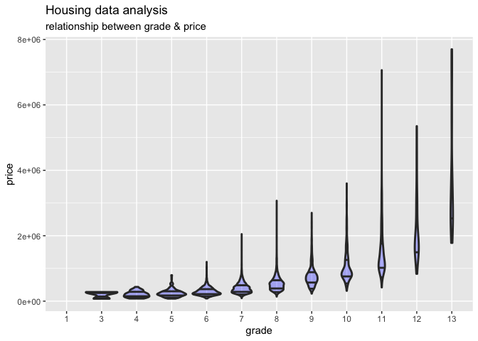
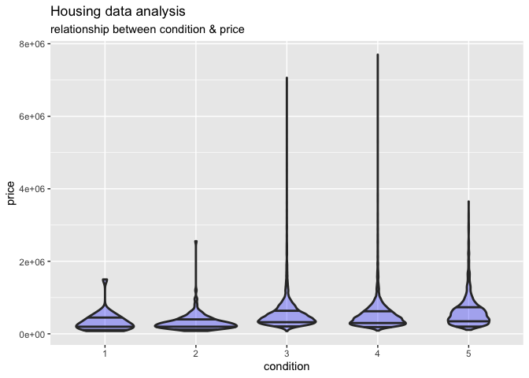
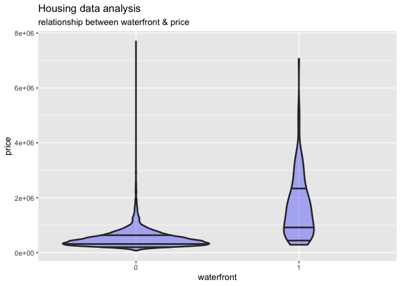
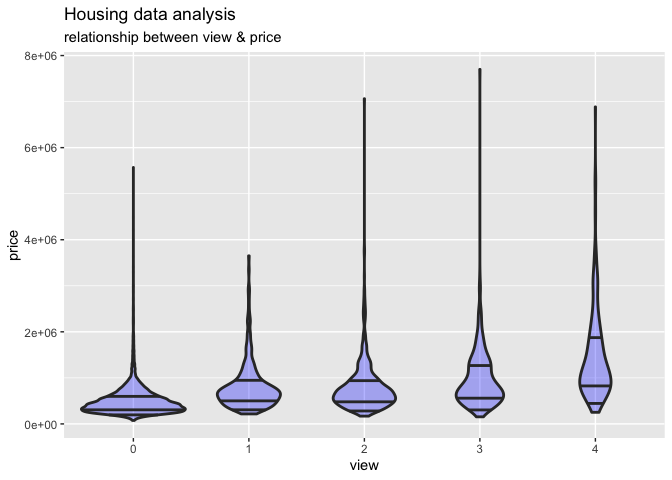

KC\_Housing\_Final
================

``` r
#Load libraries

library(dplyr)
```

    ## 
    ## Attaching package: 'dplyr'

    ## The following objects are masked from 'package:stats':
    ## 
    ##     filter, lag

    ## The following objects are masked from 'package:base':
    ## 
    ##     intersect, setdiff, setequal, union

``` r
library(ggplot2)
library(ggdendro)
library(stringr)
library(corrgram)
library(randomForest)
```

    ## randomForest 4.6-14

    ## Type rfNews() to see new features/changes/bug fixes.

    ## 
    ## Attaching package: 'randomForest'

    ## The following object is masked from 'package:ggplot2':
    ## 
    ##     margin

    ## The following object is masked from 'package:dplyr':
    ## 
    ##     combine

``` r
library(GGally)
```

    ## Registered S3 method overwritten by 'GGally':
    ##   method from   
    ##   +.gg   ggplot2

``` r
library(caret)
```

    ## Loading required package: lattice

    ## 
    ## Attaching package: 'lattice'

    ## The following object is masked from 'package:corrgram':
    ## 
    ##     panel.fill

``` r
library(tidyverse)
```

    ## ── Attaching packages ─────────────────────────────────────── tidyverse 1.3.1 ──

    ## ✓ tibble  3.1.6     ✓ purrr   0.3.4
    ## ✓ tidyr   1.1.4     ✓ forcats 0.5.1
    ## ✓ readr   2.1.1

    ## ── Conflicts ────────────────────────────────────────── tidyverse_conflicts() ──
    ## x randomForest::combine() masks dplyr::combine()
    ## x dplyr::filter()         masks stats::filter()
    ## x dplyr::lag()            masks stats::lag()
    ## x purrr::lift()           masks caret::lift()
    ## x randomForest::margin()  masks ggplot2::margin()

``` r
library(readxl)
library(rpart)
library(rpart.plot)
library(rsample)

#Set seed for consistent output
set.seed(1234)

#Data wrangling completed in Excel
#All of the data was in one column separted by commas, used delimeter to separate the values into their individual columns

#Import dataset
setwd("~/Documents/RStudio_Uploads/King_County_Housing_Analysis")
kc_house_data_1 <- read_excel("kc_house_data (1).xls")

kc_house_data_1 %>% glimpse()
```

    ## Rows: 21,613
    ## Columns: 21
    ## $ id            <dbl> 7129300520, 6414100192, 5631500400, 2487200875, 19544005…
    ## $ date          <chr> "20141013T000000", "20141209T000000", "20150225T000000",…
    ## $ price         <dbl> 221900, 538000, 180000, 604000, 510000, 1225000, 257500,…
    ## $ bedrooms      <dbl> 3, 3, 2, 4, 3, 4, 3, 3, 3, 3, 3, 2, 3, 3, 5, 4, 3, 4, 2,…
    ## $ bathrooms     <dbl> 1.00, 2.25, 1.00, 3.00, 2.00, 4.50, 2.25, 1.50, 1.00, 2.…
    ## $ sqft_living   <dbl> 1180, 2570, 770, 1960, 1680, 5420, 1715, 1060, 1780, 189…
    ## $ sqft_lot      <dbl> 5650, 7242, 10000, 5000, 8080, 101930, 6819, 9711, 7470,…
    ## $ floors        <dbl> 1.0, 2.0, 1.0, 1.0, 1.0, 1.0, 2.0, 1.0, 1.0, 2.0, 1.0, 1…
    ## $ waterfront    <dbl> 0, 0, 0, 0, 0, 0, 0, 0, 0, 0, 0, 0, 0, 0, 0, 0, 0, 0, 0,…
    ## $ view          <dbl> 0, 0, 0, 0, 0, 0, 0, 0, 0, 0, 0, 0, 0, 0, 0, 3, 0, 0, 0,…
    ## $ condition     <dbl> 3, 3, 3, 5, 3, 3, 3, 3, 3, 3, 3, 4, 4, 4, 3, 3, 3, 4, 4,…
    ## $ grade         <dbl> 7, 7, 6, 7, 8, 11, 7, 7, 7, 7, 8, 7, 7, 7, 7, 9, 7, 7, 7…
    ## $ sqft_above    <dbl> 1180, 2170, 770, 1050, 1680, 3890, 1715, 1060, 1050, 189…
    ## $ sqft_basement <dbl> 0, 400, 0, 910, 0, 1530, 0, 0, 730, 0, 1700, 300, 0, 0, …
    ## $ yr_built      <dbl> 1955, 1951, 1933, 1965, 1987, 2001, 1995, 1963, 1960, 20…
    ## $ yr_renovated  <dbl> 0, 1991, 0, 0, 0, 0, 0, 0, 0, 0, 0, 0, 0, 0, 0, 0, 0, 0,…
    ## $ zipcode       <dbl> 98178, 98125, 98028, 98136, 98074, 98053, 98003, 98198, …
    ## $ lat           <dbl> 47.5112, 47.7210, 47.7379, 47.5208, 47.6168, 47.6561, 47…
    ## $ long          <dbl> -122.257, -122.319, -122.233, -122.393, -122.045, -122.0…
    ## $ sqft_living15 <dbl> 1340, 1690, 2720, 1360, 1800, 4760, 2238, 1650, 1780, 23…
    ## $ sqft_lot15    <dbl> 5650, 7639, 8062, 5000, 7503, 101930, 6819, 9711, 8113, …

``` r
house_data_set = kc_house_data_1
```

## R Markdown make a difference

This is an R Markdown document. Markdown is a simple formatting syntax
for authoring HTML, PDF, and MS Word documents. For more details on
using R Markdown see <http://rmarkdown.rstudio.com>.

When you click the **Knit** button a document will be generated that
includes both content as well as the output of any embedded R code
chunks within the document. You can embed an R code chunk like this:

``` r
#Prepare dataset

#View class types of variables for possible data type conversion
class(kc_house_data_1$id)
```

    ## [1] "numeric"

``` r
class(kc_house_data_1$view)
```

    ## [1] "numeric"

``` r
class(kc_house_data_1$grade)
```

    ## [1] "numeric"

``` r
class(kc_house_data_1$condition)
```

    ## [1] "numeric"

``` r
class(kc_house_data_1$lat)
```

    ## [1] "numeric"

``` r
class(kc_house_data_1$long)
```

    ## [1] "numeric"

``` r
class(kc_house_data_1$price)
```

    ## [1] "numeric"

``` r
#Remove columns from dataset that won't contribute to a good predictation model
house_data_set$id <- NULL
house_data_set$zipcode <- NULL
house_data_set$yr_renovated <- NULL

#In the interest of creating a simpler model, we are removing the date from the dataset and not look at seasonal trends
house_data_set$date <- NULL

#Change variable types
house_data_set = house_data_set %>% mutate(waterfront = as.factor(waterfront),
                                           view = as.factor(view),
                                           grade = as.factor(grade), 
                                           condition = as.factor(condition), 
                                           lat = as.factor(lat), long = as.factor(long))

#Verify variable type changes
is.factor(house_data_set$waterfront)
```

    ## [1] TRUE

``` r
is.factor(house_data_set$view)
```

    ## [1] TRUE

``` r
is.factor(house_data_set$grade)
```

    ## [1] TRUE

``` r
is.factor(house_data_set$condition)
```

    ## [1] TRUE

``` r
is.factor(house_data_set$lat)
```

    ## [1] TRUE

``` r
is.factor(house_data_set$long)
```

    ## [1] TRUE

``` r
#Feature engineering - create categorical variables to analyze mean price against various criteria in the dataset.

#Create variable for Newer Construction (2004 or newer) criteria
house_data_set = house_data_set %>% mutate(new_construction = ifelse(yr_built >= 2004, TRUE, FALSE))

#Create new variable for four bedroom criteria
house_data_set = house_data_set %>% mutate(four_bedroom = ifelse(bedrooms >= 4, TRUE, FALSE))

#Create new variable for 3 bathroom criteria
house_data_set= house_data_set %>% mutate(three_bathroom = ifelse(bathrooms >= 3.00, TRUE, FALSE))

#Create new variable for 4,000 sqft living criteria
house_data_set= house_data_set %>% mutate(sqft_living_criteria = ifelse(sqft_living >= 4000, TRUE, FALSE))

#Create new variable for 4,000 sqft15 living criteria
house_data_set= house_data_set %>% mutate(sqft_living15_criteria = ifelse(sqft_living15 >= 4000, TRUE, FALSE))

#Create new variable for Good grade (7+) criteria
#summary shows that housing grades range from 1 to 13
house_data_set$grade %>% summary()
```

    ##    1    3    4    5    6    7    8    9   10   11   12   13 
    ##    1    3   29  242 2038 8981 6068 2615 1134  399   90   13

``` r
good_grade_values <- c('7', '8', '9', '10', '11', '12', '13')
house_data_set= house_data_set %>% mutate(good_grade = ifelse(grade %in% good_grade_values, TRUE, FALSE))

#Create variable for good condition (5+) criteria
house_data_set$condition %>% summary
```

    ##     1     2     3     4     5 
    ##    30   172 14031  5679  1701

``` r
good_condition_values <- c('5')
house_data_set = house_data_set %>% mutate(good_condition = ifelse(condition %in% good_condition_values, TRUE, FALSE))

#Create new variable for 5,000 sqft lot criteria
house_data_set= house_data_set %>% mutate (sqft_lot_criteria = ifelse(sqft_lot >= 5000, TRUE, FALSE))

#Create new variable for 5,000 sqft_lot15 criteria
house_data_set= house_data_set %>% mutate (sqft_lot15_criteria = ifelse(sqft_lot15 >= 5000, TRUE, FALSE))

#Add column for log of sqft_living

house_data_set = house_data_set %>% mutate (log_sqft_living = log10(sqft_living))

#Add column for square root of sqft_living

house_data_set = house_data_set %>% mutate(sqrt_sqft_living = sqrt(sqft_living))
```

``` r
#Show quick summary of average prices grouped by the individual criteria above 
#(four bedroom, three bathroom, 4,000 sqft living, 7+ good grade, 5+ good condition, & 5,000 sqft lot)

#Average price grouped by four bedroom houses
avg_price_of_four_bedrooms = house_data_set %>% na.omit() %>% 
  group_by(four_bedroom) %>% 
  summarize(mean_price = mean(price))

#Average price grouped by three bathrooms houses
avg_price_of_three_bathrooms = house_data_set %>% na.omit() %>%
  group_by(three_bathroom) %>% 
  summarize(mean_price = mean(price)) 

#Average price grouped by 4,000 sqft_living houses
avg_price_of_4000_sqft = house_data_set %>% na.omit() %>%
  group_by(sqft_living_criteria) %>% 
  summarize(mean_price = mean(price)) 

#Average price grouped by 4,000 sqft_living15 houses
avg_price_of_4000_sqft15 = house_data_set %>% na.omit() %>%
  group_by(sqft_living15_criteria) %>% 
  summarize(mean_price = mean(price)) 

#Average price grouped by 5,000 sqft lot houses
avg_price_of_5000_sqft_lot = house_data_set %>% na.omit() %>%
  group_by(sqft_lot_criteria) %>% 
  summarize(mean_price = mean(price)) 

#Average price grouuped by 5,000 sqft_lot15 houses
avg_price_of_5000_sqft_lot = house_data_set %>% na.omit() %>%
  group_by(sqft_lot15_criteria) %>% 
  summarize(mean_price = mean(price)) 

#Average prices grouped by good condition (5+) houses
avg_price_of_good_condition = house_data_set %>% na.omit() %>%
  group_by(good_condition) %>% 
  summarize(mean_price = mean(price)) 

#Average prices grouped by new construction (>2004 construction) houses
avg_price_of_new_construction = house_data_set %>% na.omit() %>%
  group_by(new_construction) %>% 
  summarize(mean_price = mean(price)) 

#Average prices grouped by good grade (7+)
avg_price_of_good_grade = house_data_set %>% na.omit() %>%
  group_by(good_grade) %>% 
  summarize(mean_price = mean(price)) 

#View summary of data
house_data_set %>% glimpse()
```

    ## Rows: 21,613
    ## Columns: 28
    ## $ price                  <dbl> 221900, 538000, 180000, 604000, 510000, 1225000…
    ## $ bedrooms               <dbl> 3, 3, 2, 4, 3, 4, 3, 3, 3, 3, 3, 2, 3, 3, 5, 4,…
    ## $ bathrooms              <dbl> 1.00, 2.25, 1.00, 3.00, 2.00, 4.50, 2.25, 1.50,…
    ## $ sqft_living            <dbl> 1180, 2570, 770, 1960, 1680, 5420, 1715, 1060, …
    ## $ sqft_lot               <dbl> 5650, 7242, 10000, 5000, 8080, 101930, 6819, 97…
    ## $ floors                 <dbl> 1.0, 2.0, 1.0, 1.0, 1.0, 1.0, 2.0, 1.0, 1.0, 2.…
    ## $ waterfront             <fct> 0, 0, 0, 0, 0, 0, 0, 0, 0, 0, 0, 0, 0, 0, 0, 0,…
    ## $ view                   <fct> 0, 0, 0, 0, 0, 0, 0, 0, 0, 0, 0, 0, 0, 0, 0, 3,…
    ## $ condition              <fct> 3, 3, 3, 5, 3, 3, 3, 3, 3, 3, 3, 4, 4, 4, 3, 3,…
    ## $ grade                  <fct> 7, 7, 6, 7, 8, 11, 7, 7, 7, 7, 8, 7, 7, 7, 7, 9…
    ## $ sqft_above             <dbl> 1180, 2170, 770, 1050, 1680, 3890, 1715, 1060, …
    ## $ sqft_basement          <dbl> 0, 400, 0, 910, 0, 1530, 0, 0, 730, 0, 1700, 30…
    ## $ yr_built               <dbl> 1955, 1951, 1933, 1965, 1987, 2001, 1995, 1963,…
    ## $ lat                    <fct> 47.5112, 47.721, 47.7379, 47.5208, 47.6168, 47.…
    ## $ long                   <fct> -122.257, -122.319, -122.233, -122.393, -122.04…
    ## $ sqft_living15          <dbl> 1340, 1690, 2720, 1360, 1800, 4760, 2238, 1650,…
    ## $ sqft_lot15             <dbl> 5650, 7639, 8062, 5000, 7503, 101930, 6819, 971…
    ## $ new_construction       <lgl> FALSE, FALSE, FALSE, FALSE, FALSE, FALSE, FALSE…
    ## $ four_bedroom           <lgl> FALSE, FALSE, FALSE, TRUE, FALSE, TRUE, FALSE, …
    ## $ three_bathroom         <lgl> FALSE, FALSE, FALSE, TRUE, FALSE, TRUE, FALSE, …
    ## $ sqft_living_criteria   <lgl> FALSE, FALSE, FALSE, FALSE, FALSE, TRUE, FALSE,…
    ## $ sqft_living15_criteria <lgl> FALSE, FALSE, FALSE, FALSE, FALSE, TRUE, FALSE,…
    ## $ good_grade             <lgl> TRUE, TRUE, FALSE, TRUE, TRUE, TRUE, TRUE, TRUE…
    ## $ good_condition         <lgl> FALSE, FALSE, FALSE, TRUE, FALSE, FALSE, FALSE,…
    ## $ sqft_lot_criteria      <lgl> TRUE, TRUE, TRUE, TRUE, TRUE, TRUE, TRUE, TRUE,…
    ## $ sqft_lot15_criteria    <lgl> TRUE, TRUE, TRUE, TRUE, TRUE, TRUE, TRUE, TRUE,…
    ## $ log_sqft_living        <dbl> 3.071882, 3.409933, 2.886491, 3.292256, 3.22530…
    ## $ sqrt_sqft_living       <dbl> 34.35113, 50.69517, 27.74887, 44.27189, 40.9878…

``` r
house_data_set %>% summary()
```

    ##      price            bedrooms        bathrooms      sqft_living   
    ##  Min.   :  75000   Min.   : 0.000   Min.   :0.000   Min.   :  290  
    ##  1st Qu.: 321950   1st Qu.: 3.000   1st Qu.:1.750   1st Qu.: 1427  
    ##  Median : 450000   Median : 3.000   Median :2.250   Median : 1910  
    ##  Mean   : 540088   Mean   : 3.371   Mean   :2.115   Mean   : 2080  
    ##  3rd Qu.: 645000   3rd Qu.: 4.000   3rd Qu.:2.500   3rd Qu.: 2550  
    ##  Max.   :7700000   Max.   :33.000   Max.   :8.000   Max.   :13540  
    ##                                                                    
    ##     sqft_lot           floors      waterfront view      condition
    ##  Min.   :    520   Min.   :1.000   0:21450    0:19489   1:   30  
    ##  1st Qu.:   5040   1st Qu.:1.000   1:  163    1:  332   2:  172  
    ##  Median :   7618   Median :1.500              2:  963   3:14031  
    ##  Mean   :  15107   Mean   :1.494              3:  510   4: 5679  
    ##  3rd Qu.:  10688   3rd Qu.:2.000              4:  319   5: 1701  
    ##  Max.   :1651359   Max.   :3.500                                 
    ##                                                                  
    ##      grade        sqft_above   sqft_basement       yr_built         lat       
    ##  7      :8981   Min.   : 290   Min.   :   0.0   Min.   :1900   47.5322:   17  
    ##  8      :6068   1st Qu.:1190   1st Qu.:   0.0   1st Qu.:1951   47.5491:   17  
    ##  9      :2615   Median :1560   Median :   0.0   Median :1975   47.6624:   17  
    ##  6      :2038   Mean   :1788   Mean   : 291.5   Mean   :1971   47.6846:   17  
    ##  10     :1134   3rd Qu.:2210   3rd Qu.: 560.0   3rd Qu.:1997   47.6711:   16  
    ##  11     : 399   Max.   :9410   Max.   :4820.0   Max.   :2015   47.6886:   16  
    ##  (Other): 378                                                  (Other):21513  
    ##        long       sqft_living15    sqft_lot15     new_construction
    ##  -122.29 :  116   Min.   : 399   Min.   :   651   Mode :logical   
    ##  -122.3  :  111   1st Qu.:1490   1st Qu.:  5100   FALSE:18021     
    ##  -122.362:  104   Median :1840   Median :  7620   TRUE :3592      
    ##  -122.291:  100   Mean   :1987   Mean   : 12768                   
    ##  -122.372:   99   3rd Qu.:2360   3rd Qu.: 10083                   
    ##  -122.363:   99   Max.   :6210   Max.   :871200                   
    ##  (Other) :20984                                                   
    ##  four_bedroom    three_bathroom  sqft_living_criteria sqft_living15_criteria
    ##  Mode :logical   Mode :logical   Mode :logical        Mode :logical         
    ##  FALSE:12796     FALSE:18983     FALSE:20823          FALSE:21357           
    ##  TRUE :8817      TRUE :2630      TRUE :790            TRUE :256             
    ##                                                                             
    ##                                                                             
    ##                                                                             
    ##                                                                             
    ##  good_grade      good_condition  sqft_lot_criteria sqft_lot15_criteria
    ##  Mode :logical   Mode :logical   Mode :logical     Mode :logical      
    ##  FALSE:2313      FALSE:19912     FALSE:4932        FALSE:4722         
    ##  TRUE :19300     TRUE :1701      TRUE :16681       TRUE :16891        
    ##                                                                       
    ##                                                                       
    ##                                                                       
    ##                                                                       
    ##  log_sqft_living sqrt_sqft_living
    ##  Min.   :2.462   Min.   : 17.03  
    ##  1st Qu.:3.154   1st Qu.: 37.78  
    ##  Median :3.281   Median : 43.70  
    ##  Mean   :3.279   Mean   : 44.60  
    ##  3rd Qu.:3.407   3rd Qu.: 50.50  
    ##  Max.   :4.132   Max.   :116.36  
    ## 

    ## `geom_smooth()` using formula 'y ~ x'

<!-- -->

    ## `geom_smooth()` using formula 'y ~ x'

<!-- -->

    ## `geom_smooth()` using formula 'y ~ x'

<!-- -->

    ## `geom_smooth()` using formula 'y ~ x'

<!-- -->

    ## `geom_smooth()` using formula 'y ~ x'

<!-- -->

    ## Warning: Groups with fewer than two data points have been dropped.

    ## Warning in regularize.values(x, y, ties, missing(ties), na.rm = na.rm):
    ## collapsing to unique 'x' values
    
    ## Warning in regularize.values(x, y, ties, missing(ties), na.rm = na.rm):
    ## collapsing to unique 'x' values
    
    ## Warning in regularize.values(x, y, ties, missing(ties), na.rm = na.rm):
    ## collapsing to unique 'x' values

<!-- -->

    ## Warning in regularize.values(x, y, ties, missing(ties), na.rm = na.rm):
    ## collapsing to unique 'x' values
    
    ## Warning in regularize.values(x, y, ties, missing(ties), na.rm = na.rm):
    ## collapsing to unique 'x' values
    
    ## Warning in regularize.values(x, y, ties, missing(ties), na.rm = na.rm):
    ## collapsing to unique 'x' values

<!-- -->

    ## Warning in regularize.values(x, y, ties, missing(ties), na.rm = na.rm):
    ## collapsing to unique 'x' values

<!-- -->

    ## Warning in regularize.values(x, y, ties, missing(ties), na.rm = na.rm):
    ## collapsing to unique 'x' values
    
    ## Warning in regularize.values(x, y, ties, missing(ties), na.rm = na.rm):
    ## collapsing to unique 'x' values
    
    ## Warning in regularize.values(x, y, ties, missing(ties), na.rm = na.rm):
    ## collapsing to unique 'x' values

<!-- -->

Note that the `echo = FALSE` parameter was added to the code chunk to
prevent printing of the R code that generated the plot.
